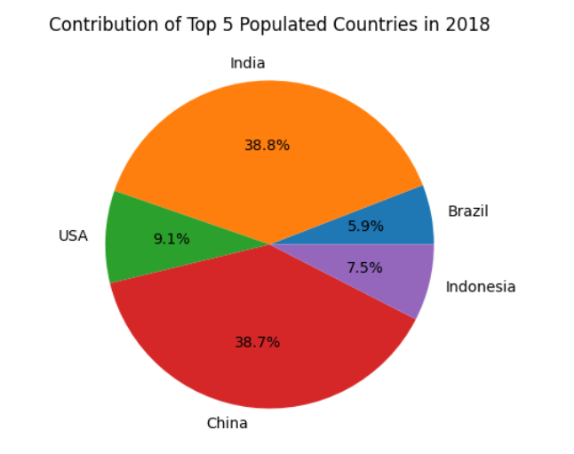

# Global Population Analysis (1960 – 2022)

## Project Overview

This project analyzes **global population trends from 1960 to 2022** using Python for data analysis and visualization.

The goal of this project is to explore how population has grown across countries over time and identify the countries contributing the most to global population growth.

The project demonstrates **data cleaning, preprocessing, exploratory data analysis (EDA), dataset merging, and visualization techniques**.

This type of analysis is commonly used in **data analytics, business intelligence, and demographic research**.

---

## Objectives

The main objectives of this project are:

• Clean and preprocess population datasets  
• Handle missing values using statistical techniques  
• Merge multiple datasets for better analysis  
• Calculate the **average population for each country**  
• Identify the **top populated countries globally**  
• Analyze **population trends over time**  
• Create clear and meaningful **data visualizations**

---

## Dataset

The project uses two datasets:

### 1️⃣ Population Dataset
Contains yearly population data from **1960 to 2022**.

### 2️⃣ Country Metadata
Contains country codes and additional country information.

After cleaning and merging, the final dataset includes:

- Country Name
- Country Code
- Population values across multiple years

---

## Technologies Used

The project is implemented using the following tools:

- Python
- Pandas (data manipulation)
- NumPy (numerical computations)
- Matplotlib (data visualization)
- Seaborn (statistical visualization)
- Jupyter Notebook

---

## Data Processing Steps

### Data Cleaning

Unnecessary columns were removed and relevant population columns were selected for analysis.

---

### Handling Missing Values

Missing values were replaced using the **mean of the respective column** to maintain dataset consistency.

```python
data[numeric_columns] = data[numeric_columns].fillna(data[numeric_columns].mean())
```

---

### Feature Engineering

A new feature called **Average Population** was created to identify the countries with the highest population across the years.

```python
data['Avg_Population'] = data.iloc[:,1:-1].mean(axis=1)
```

---

### Dataset Merging

Two datasets were merged using the **Country Name** column.

```python
countries = pd.merge(data, df1, on='Country Name', how='inner')
```

---

## Exploratory Data Analysis

Exploratory analysis was performed to identify:

• Top populated countries  
• Population growth trends  
• Population contribution of major countries  


### Population Distribution

Pie chart representing contribution of major countries to global population.



---

## Key Insights

• **China and India** have consistently been the most populated countries in the world.  

• Population growth has steadily increased since the 1960s.  

• Countries like **Indonesia, Brazil, and the United States** contribute significantly to global population.

• Population distribution varies greatly across regions.

---

## Project Structure

```
global-population-analysis
│
├── data
│   ├── population_data.csv
│
├── notebooks
│   └── population_analysis.ipynb
│
├── images
│   ├── plots
│
├── requirements.txt
└── README.md
```

---

## Future Improvements

Some potential improvements for this project include:

• Building an **interactive Power BI dashboard**  
• Implementing **time series forecasting for population prediction**  
• Creating **country-level demographic analysis dashboards**  
• Integrating additional datasets such as **GDP and urban population**

---

## Author

**Asin Fraisiya**

BCA – Data Analytics  
Aspiring Data Analyst | Python | Data Visualization | Power BI

GitHub  
https://github.com/asinantony
